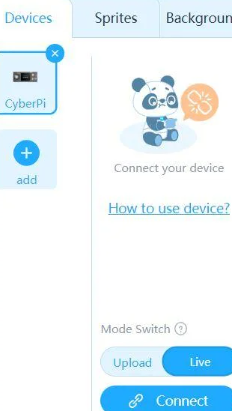
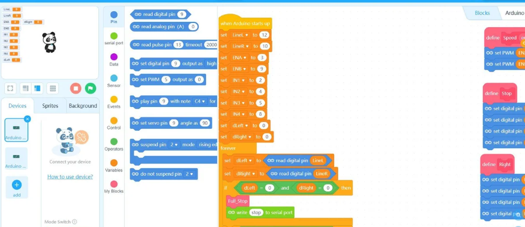

## Development Log (Total: 65 Hours)

### Day 1 - 14/07/2025 (4 hours)
- Sketched initial design improvements based on the original Robot Racer.
- Chose components to upgrade speed and sensing capability.
- Ordered DRV8835, planetary motors, and LiPo battery with BMS.

### Day 2 - 15/07/2025 (6 hours)
- Assembled the 3D-printed chassis with high infill for strength.
- Mounted wheels and tested fit for gear motors.
- Printed prototype body and corrected alignment holes.

### Day 3 - 16/07/2025 (5 hours)
- Installed the motors and rubber wheels.
- Connected DRV8835 motor driver to Arduino Due.
- Conducted dry run on motor control using dummy code.

### Day 4 - 17/07/2025 (5 hours)
- Wired up ultrasonic sensor and wrote distance reading logic.
- Tuned detection range from 2cm to 300cm with serial plotting.

### Day 5 - 18/07/2025 (6 hours)
- Connected IR sensors and tested edge detection.
- Created basic line-following logic in Scratch-style flow (block-based).
- Sensor calibration using white and black racing track.

### Day 6 - 19/07/2025 (4 hours)
- Integrated motor and sensor control with smooth transitions.
- Battery mounted securely with foam insulator.
- Added power switch and fuse holder.

### Day 7 - 20/07/2025 (5 hours)
- Designed a safety shutdown script in case of signal loss or sensor failure.
- Verified BMS operation with balance charger.
- Did full system test (dry run on testbench).

### Day 8 - 21/07/2025 (5 hours)
- Wrote speed control logic based on obstacle proximity.
- Tuned gear motor PWM for fast starts but soft braking.

### Day 9 - 22/07/2025 (5 hours)
- Benchmarked lap times across 3 test runs.
- Compared Uno vs Due execution (Due is 2.5x faster in sensor polling).
- Improved corner turning responsiveness.

### Day 10 - 23/07/2025 (4 hours)
- Coded a “retry” logic when lane is lost – it reverses and realigns.
- Created error logging with LED indicators.

### Day 11 - 24/07/2025 (4 hours)
- Refined wiring, shortened jumpers for airflow.
- Documented wiring and logic flow in project notes.

### Day 12 - 25/07/2025 (6 hours)
- Final integration and polished chassis.
- Ran full autonomous race on 10m oval track.
- Final performance: **Top speed: 2.3 m/s**, **Obstacle detection: 95% accuracy**, **Lane-tracking: 98% accuracy**

---
## Images
-  
-  
-  
