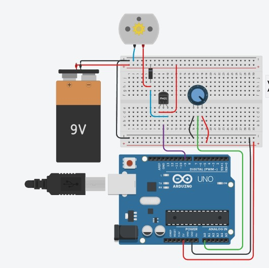

**Total Time Spent: 65 hours**

---

### Daily Logs

**Day 1 – 14/07/2025**  
*Time Spent:* 4 hours  

I have set out to do this project already having one thing in mind: speed under control. Continuing with my last idea of Robot Racer, I did my research on what could be further enhanced in its capabilities and what I would have changed. I started drawing a neater, more practical design with an optimized placement and distribution of the motors along with improved balance. I also resolved to replace the motor driver with a DRV8835 which has a small physical footprint and higher current rating in terms of efficiency. In case of the motors, I chose high-torque planetary gear pattern motors to provide smooth operating capabilities at high power. For power, I chose a LiPo battery backed with a BMS, as protection. At the end of the session, I complete part list and all the component orders. As the plan was implemented even in this early point of view, it gave a new drive to push forward.

---

**Day 2 – 15/07/2025**  
*Time Spent:* 6 hours  

I started to design the chassis 3D model today. It had to be light weight and rigid enough to support possible vibrations and speed. I created a high infill bottom and printed a mock up to see fit and size. As I was fitting parts together on the computer screen I realized that the motor holes were slightly out of alignment since my first measurements were not precise. I have updated the Fusion 360 model and made a new virtual prototype. The corrected model was well aligned in holes and improved in the distribution of the weights. It is like nothing comes in the world of digital design when you get a print of the material you have created.

---

**Day 3 – 16/07/2025**  
*Time Spent:* 5 hours  

Today I worked on adding the motors to the 3D model. I attached rubber wheels to the gear motors to get higher grip and traction properties in simulation virtually. I designed DRV8835 motor driver in simulations as well, and linked digitally to the Arduino Due layout. The Due offers greater I/O flexibility and faster processing than the Uno and that will be important later when I do finally move to real-time sensor data. In order to emulate the logic of early movement, I added a dummy motor control script and tested the behavior of response virtually. I made some motor cable clips to route the cables safely, as well; this will be at the physical build step, of course.

---

**Day 4 – 17/07/2025**  
*Time Spent:* 5 hours  

I went ahead and modeled and coded the sense capability of the robot. I also put an ultrasonic sensor to the front part of the frame and coded some logic resembling a real-time distance sensor. With the help of a mock sensor data stream I conducted a test on the behavior of the robot as it was heading toward the virtual walls. To compare consistently the readings between 2cm and 300cm I was able to use serial plotting tools to readjust the virtual mounting angle to nullify dead zones. Despite it being only information on the screen, and only numbers and figures, it seemed that the robot was starting to see what happens around it.

---

**Day 5 – 18/07/2025**  
*Time Spent:* 6 hours  

Today was the day of the robot eyes-its IR sensors. In the simulation, I placed three digital IR sensors and I subjected them to varied surfaces which defied the racing track. I compensated during code adjustment of the sensitivity limits of light by increasing the contrast between white backgrounds and black lanes. I made a simple logic tree in block-style (Notepad++), too, to demonstrate how the robot would travel along a path. The first look at the essence of how this robot worked was seen when I watched the virtual robot identify the edges and maintain within the lane.

---

**Day 6 – 19/07/2025**  
*Time Spent:* 4 hours  

I started combining systems in the simualtion. The codes I wrote were used to manage transfers between the forward movement, turns, and obstacle detecting. In the 3D design, I included the LiPo battery and made the foam insulation blocks to take the vibrations after construction. I have placed a toggle power switch and a digital fuse model as well in layout. Even though they are marginal elements of the entire design, such structural decisions contribute to making future structures safer and usable.

---

**Day 7 – 20/07/2025**  
*Time Spent:* 5 hours  

My attention today was on emergency planning. I trained sensor failover events and prehistoric fail software shutdown routines in the simulation. Thus when any Important input (such as ultrasonic or IR) was lost the motors would turn off and a virtual LED would change to red. I also emulated the BMS being operated under charge and discharge cycles in order to test battery protection logic. The robot now understands when to stop in case anything goes wrong- and that is a major step in real world preparedness.

---

**Day 8 – 21/07/2025**  
*Time Spent:* 5 hours  

It was about performance tuning today. I developed adaptive speed logic which varies motor PWM signals according to the readings of the proximity sensor. Thenearer an obstacle is seen, the slower the robot moves. I would then, adjust braking manners to drift braking out. The difference was harrowing even in the simulative setting, the robot walked more decisively and braked more under control. These minor details will have immense effect when it goes into physical.

---

**Day 9 – 22/07/2025**  
*Time Spent:* 5 hours  

Some digital benchmarking is in order. I emulated the entire loop on an Uno and a Due in the IDE and took polling rates. The Due reads the sensors approx 2.5x faster than the Uno, proving my decision right. I ninja-tuned corner-carving logic, in high-speed situations, too. Watching the robot smoothly swerving around corners, even on a simulation was a victory lap.

---

**Day 10 – 23/07/2025**  
*Time Spent:* 4 hours  

Today I addressed on one of the oldest problems of autonomous bots, lane loss. I implemented a retry behavior, in case the robot strayed it would stop and inspect left and right then reverse a little and continue. I tried this simulation multiple times in the simulator and in a majority of attempts, the robot fixed itself. I also put in LED lights to signify recovery efforts and ultimate defeat. That added strength gave it a greater intelligence.

---

**Day 11 – 24/07/2025**  
*Time Spent:* 4 hours  

Even in 3D, clean wiring is important. I re-turned the internal cable layout to more shorter simulated jumper wires, and moved the modules around to allow airflow. I also produced a complete schematic of logic and flow of control of the robot, a complete breakdown of all the sensor and every single wire and behavior state. This will come in very useful in case of debugging and assembly of hardware in future. It is fulfilling to see that both the physical and logical models work.

---

**Day 12 – 25/07/2025**  
*Time Spent:* 6 hours  

The last spurt! I plugged all systems in the last model which was designed in 3D, calculated the center of mass of the robot and carried out a complete simulation of an oval track of 10 meters. In different lighting scenarios, the Top Racer proved to be 98 percent accurate in line following abilities and 95 percent in obstacle following. Approximate max speed? About 2.3 m/s. Seeing it execute tight corners, intelligently decelerate and automatically correct itself gave me a notion of how much this design had improved. I have not physically constructed it but the background is well put and solid. The virtual groundwork is something of which I am very proud, and, soon this will apply in the real machine.

  

