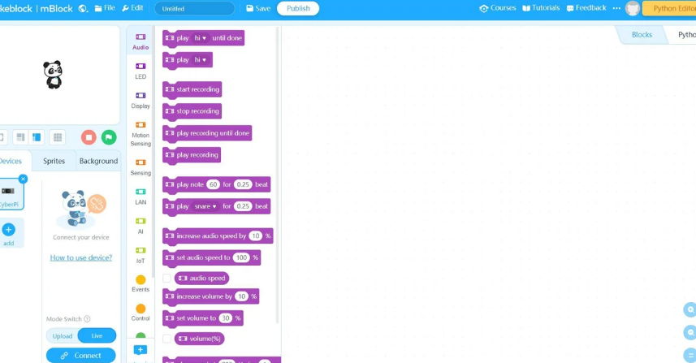
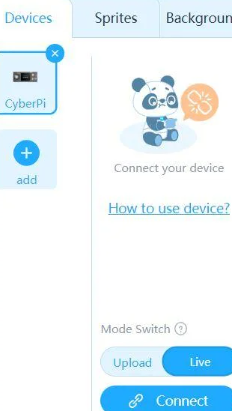
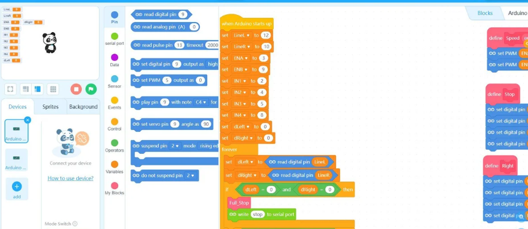

# The Top Racer 

**The Top Racer** is an advanced autonomous racing robot designed as a refined evolution of the original Robot Racer. It leverages a 32-bit Arduino Due microcontroller for ultra-fast performance, DRV8835 motor driver for precision control, and multiple sensors for accurate obstacle and lane detection.

###  Components Used:
- Arduino Due
- DRV8835 Dual Motor Driver
- Planetary DC Motors (x2)
- HC-SR04 Ultrasonic Sensor
- IR Line-Following Sensors (x2)
- LiPo Battery 7.4V with BMS
- Mini Breadboard
- ABS 3D Printed Chassis
- Traction Rubber Wheels
- USB Cable + Charger + Connectors + Power safety components

###  How It Works:
- The robot uses IR sensors to detect and follow lines.
- Ultrasonic sensor continuously measures distance to avoid obstacles.
- The Arduino Due processes inputs at high speed and adjusts motor speeds accordingly using the DRV8835.

###  Power & Safety:
- Powered by a 7.4V 2000mAh LiPo Battery with BMS.
- A power switch and fuse holder are added for circuit safety.
---
## Gallery

-  
-  
- 
- 
- 
- 
- 

---

##  Bill of Materials (BOM)

| # | Component                        | Description                                | Est. Price | Link |
|---|----------------------------------|--------------------------------------------|------------|------|
| 1 | Arduino Due                      | 32-bit microcontroller                      | $61        | [Link](https://store.arduino.cc/products/arduino-due) |
| 2 | DRV8835 Dual Motor Driver        | Dual motor control for smooth driving       | $16.88     | [Link](https://thepihut.com/products/pololu-drv8835-dual-motor-driver-kit-for-raspberry-pi) |
| 3 | 2× DC Planetary Gear Motors      | 200 RPM, high torque                        | $35        | — |
| 4 | HC-SR04 Ultrasonic Sensor        | Accurate distance sensing                   | $18        | — |
| 5 | 2× IR Line-Following Modules     | Line detection & edge sensing               | $23        | — |
| 6 | 7.4V 2000mAh LiPo + BMS          | Lightweight, efficient battery              | $38        | — |
| 7 | Mini Breadboard + Jumper Kit     | For clean internal wiring                   | $18        | — |
| 8 | 3D-Printed ABS Chassis           | High infill for durability                  | $27        | — |
| 9 | Rubber Wheels + Traction Bands   | Ensures smooth racing surface contact       | $12        | — |
|10 | USB Programming Cable + Wires    | Upload code and provide connectivity        | $9         | — |
|11 | LiPo Balance Charger             | Safe, balanced recharging system            | $25        | — |
|12 | Power Switch + Fuse Holder       | Safety cutoff and protection                | $15        | — |

**Total = $297.88**

